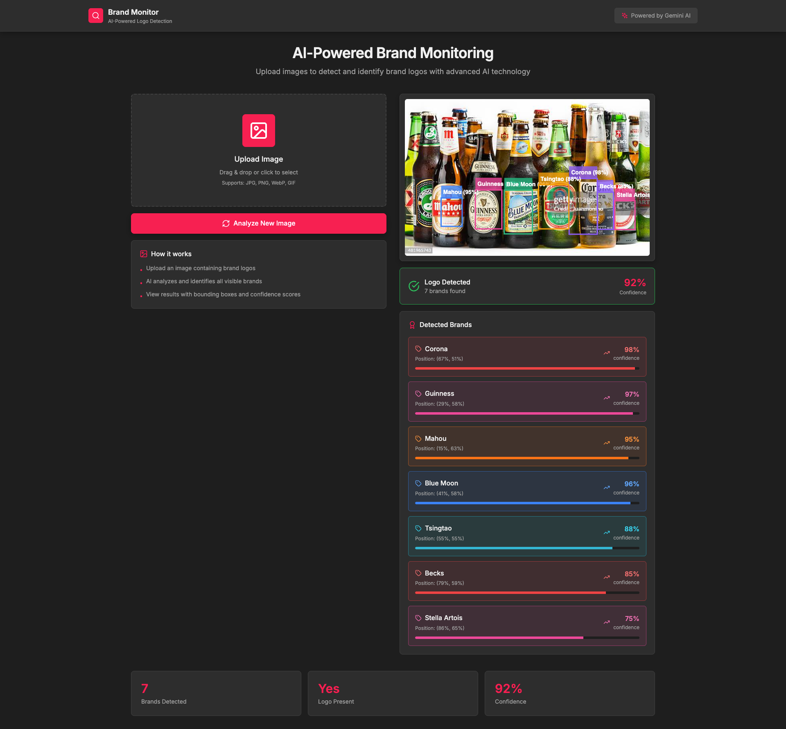
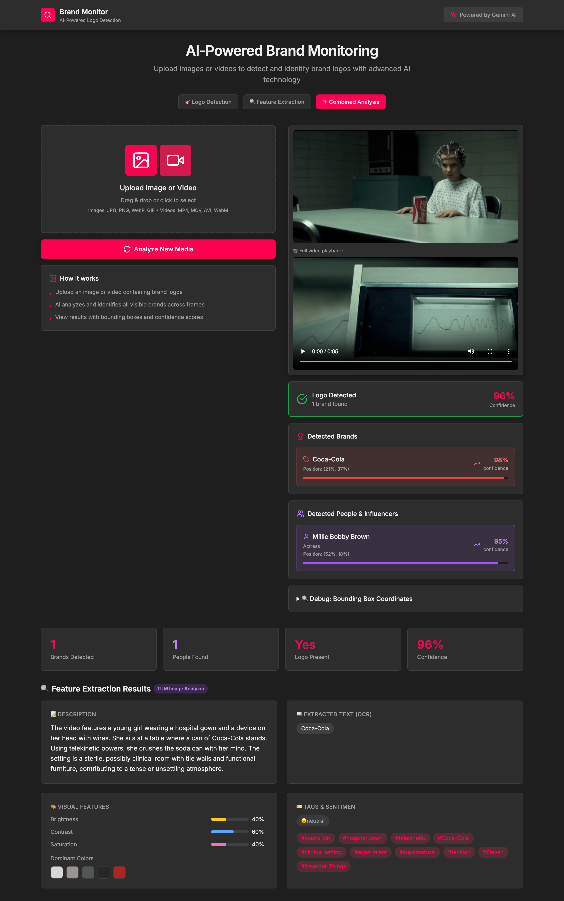
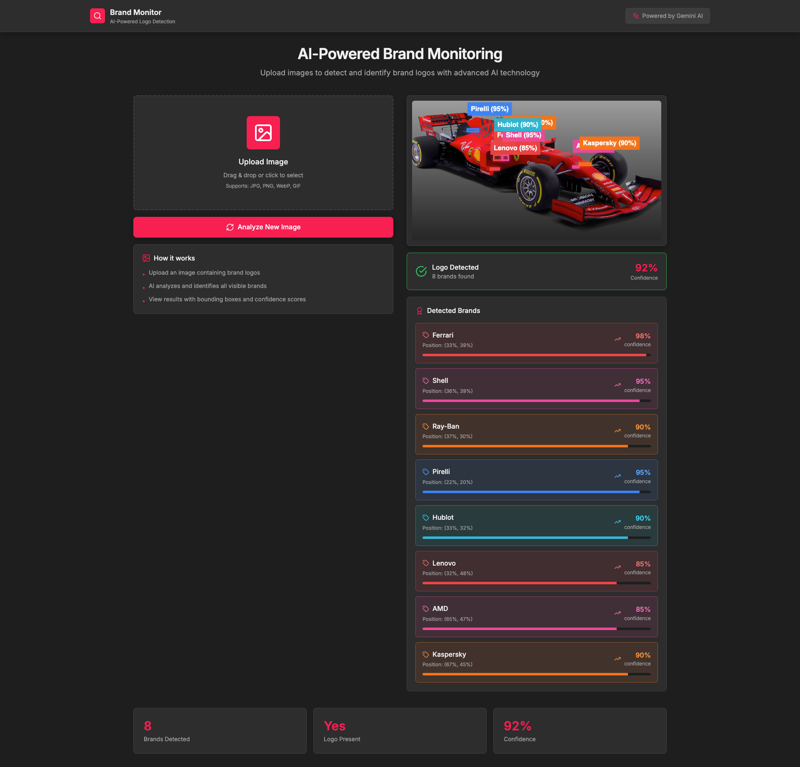
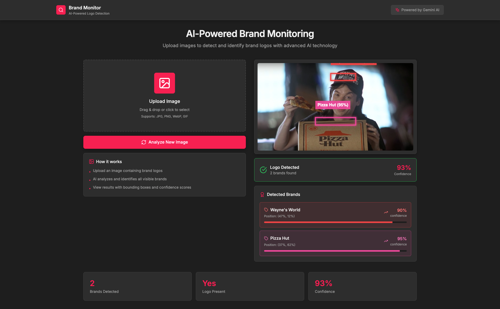
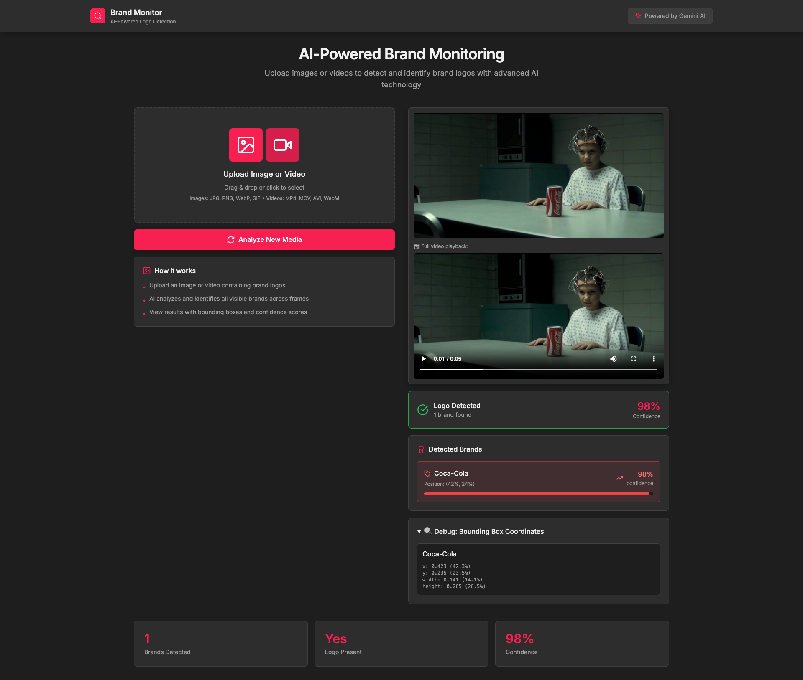

<div align="center">

# 🎯 Brand Monitor

### AI-Powered Logo Detection & Brand Intelligence

*Detect, identify, and analyze brand logos in images and videos using Google Gemini AI*

[](https://ai.google.dev/)
[](https://nextjs.org/)
[](https://www.typescriptlang.org/)
[](https://tailwindcss.com/)

---



*Detecting 7 beer brands with 92% confidence — Corona, Guinness, Blue Moon, and more*

</div>

---

## ✨ Features

<table>
<tr>
<td width="50%">

### 🖼️ Image Analysis
Upload any image and instantly detect all visible brand logos with precise bounding boxes and confidence scores.

### 🎬 Video Analysis
Analyze videos frame-by-frame to track brand appearances across time — perfect for monitoring product placements.

### 📦 Visual Bounding Boxes
Color-coded overlays show exactly where each brand appears in your media with real-time visualization.

</td>
<td width="50%">

### 📊 Confidence Metrics
Get detailed confidence scores for each detection, helping you understand AI certainty levels.

### 🏷️ Multi-Brand Detection
Detect multiple brands simultaneously — tested with up to 11+ brands in a single image.

### ⚡ Real-Time Processing
Fast analysis powered by Gemini 2.0 Flash delivers results in seconds.

</td>
</tr>
</table>

### 🔍 Feature Extraction Mode

Inspired by the [**TUM Image Analyzer**](https://github.com/digital-marketing-tum/image-analyzer) research project from the Technical University of Munich, we implemented a similar feature extraction output format powered by **Google Gemini AI**:

| Feature | Description |
|---------|-------------|
| **OCR Extraction** | AI-detected visible text from images (brand names, slogans, prices) |
| **LLM Description** | AI-generated rich descriptions of image content |
| **Visual Features** | AI-estimated brightness, contrast, saturation, and dominant colors |
| **Tags & Sentiment** | Automatic tagging and sentiment analysis |
| **Person Detection** | Identify people and influencers in media content |

> **🚧 Coming Soon:** We are actively working on integrating the actual TUM Image Analyzer library for computed pixel-level metrics. The current implementation uses Gemini AI to estimate these features.

Select from three analysis modes:
- **🎯 Logo Detection**: Fast brand logo identification with bounding boxes
- **🔍 Feature Extraction**: Gemini-powered analysis inspired by TUM methodology
- **✨ Combined Analysis**: Both logo detection and feature extraction together

<div align="center">



*Combined Analysis mode detecting Coca-Cola (98% confidence) and Millie Bobby Brown in a Stranger Things clip — showcasing logo detection + Gemini-powered feature extraction with OCR, visual features, and sentiment tags*

</div>

---

## 🎬 See It In Action

<div align="center">

### 🏎️ Sponsor Detection in F1 Racing



*8 sponsor brands detected on a Ferrari F1 car — Ferrari, Shell, Ray-Ban, Pirelli, Hublot, Lenovo, AMD, Kaspersky*

---

### 🎬 Product Placement in Movies



*Wayne's World Pizza Hut scene — detecting iconic product placement with 93% confidence*

---

### 📹 Video Brand Tracking



*Stranger Things Coca-Cola placement — video analysis with frame extraction and 98% confidence*

---

### ✨ Combined Analysis (Logo + Feature Extraction)


*Full Combined Analysis: Coca-Cola detection (98%), influencer recognition (Millie Bobby Brown, 95%), OCR text extraction, visual features (brightness, contrast, saturation), dominant colors, and AI-generated sentiment tags — all powered by Google Gemini AI*

</div>

---

## 🚀 Quick Start

### Prerequisites

- **Node.js 18+** installed
- **Google AI API Key** — [Get one free here](https://aistudio.google.com/app/apikey)

### Installation

```bash
# 1. Clone the repository
git clone https://github.com/yourusername/brand-monitoring-app.git
cd brand-monitoring-app

# 2. Install dependencies
npm install

# 3. Set up your API key
echo "GOOGLE_API_KEY=your_api_key_here" > .env.local

# 4. Start the development server
npm run dev
```

Open [http://localhost:3000](http://localhost:3000) and start detecting brands! 🎉

---

## 🎨 How It Works

```
┌─────────────────┐     ┌─────────────────┐     ┌─────────────────┐
│                 │     │                 │     │                 │
│  Upload Image   │ ──▶ │   Gemini AI     │ ──▶ │    Results      │
│   or Video      │     │   Analysis      │     │  + Bounding Box │
│                 │     │                 │     │                 │
└─────────────────┘     └─────────────────┘     └─────────────────┘
        │                       │                       │
   Drag & Drop            Vision Model            Visual Overlay
   Click to Select        Logo Detection          Confidence Scores
   Multi-format           Brand Recognition       Position Data
```

1. **Upload** — Drag and drop or click to upload images (JPG, PNG, WebP, GIF) or videos (MP4, MOV, AVI, WebM)
2. **Analyze** — Gemini AI processes your media and identifies all visible brand logos
3. **Visualize** — See results with interactive bounding boxes, confidence scores, and brand details

---

## 🏗️ Project Structure

```
brand-monitoring-app/
├── app/
│   ├── api/
│   │   └── analyze/
│   │       └── route.ts          # API endpoint for logo detection
│   ├── components/
│   │   ├── Header.tsx            # App header with branding
│   │   ├── MediaUpload.tsx       # Drag & drop upload component
│   │   ├── ResultsDisplay.tsx    # Results with bounding boxes
│   │   ├── BrandCard.tsx         # Individual brand result card
│   │   └── InfluencerCard.tsx    # Influencer analysis card
│   ├── globals.css               # Global styles & animations
│   ├── layout.tsx                # Root layout
│   ├── page.tsx                  # Main application page
│   └── types.ts                  # TypeScript definitions
├── public/
│   └── screenshots/              # Demo screenshots
├── package.json
├── tailwind.config.js
└── tsconfig.json
```

---

## 🔧 Tech Stack

| Technology | Purpose |
|------------|---------|
| **Next.js 14** | React framework with App Router |
| **TypeScript** | Type-safe development |
| **Tailwind CSS** | Utility-first styling |
| **Google Gemini 2.0** | Vision AI for logo detection |
| **React Dropzone** | File upload with drag & drop |
| **Lucide React** | Beautiful icon library |
| **Canvas API** | Drawing bounding boxes |

---

## 📊 API Reference

### `POST /api/analyze`

Analyze an image for brand logo detection.

**Request:**
```json
{
  "image": "base64_encoded_image_data",
  "mimeType": "image/jpeg"
}
```

**Response:**
```json
{
  "hasLogo": true,
  "brands": [
    {
      "name": "Corona",
      "confidence": 0.98,
      "boundingBox": {
        "x": 0.67,
        "y": 0.51,
        "width": 0.15,
        "height": 0.20
      }
    }
  ],
  "confidence": 0.92,
  "description": "Detected Corona beer logo in the center-right of the image"
}
```

---

## 🎯 Use Cases

<table>
<tr>
<td align="center" width="25%">
<h3>📱</h3>
<b>Social Media Monitoring</b><br>
Track brand mentions in user-generated images
</td>
<td align="center" width="25%">
<h3>📈</h3>
<b>Marketing Analytics</b><br>
Measure brand visibility in campaigns
</td>
<td align="center" width="25%">
<h3>🏆</h3>
<b>Competitor Analysis</b><br>
Monitor competitor brand presence
</td>
<td align="center" width="25%">
<h3>🎬</h3>
<b>Product Placement</b><br>
Detect brands in video content
</td>
</tr>
</table>

---

## 🚀 Deployment

### Vercel (Recommended)

[](https://vercel.com/new/clone?repository-url=https://github.com/yourusername/brand-monitoring-app)

1. Click the button above
2. Add your `GOOGLE_API_KEY` environment variable
3. Deploy!

### Other Platforms

Works with any platform supporting Next.js:
- Netlify
- AWS Amplify
- Google Cloud Run
- Railway
- Fly.io

---

## 🔒 Environment Variables

| Variable | Description | Required |
|----------|-------------|:--------:|
| `GOOGLE_API_KEY` | Google AI Studio API key | ✅ |

---

## 🙏 Acknowledgments

The Feature Extraction mode was inspired by the [**TUM Image Analyzer**](https://github.com/digital-marketing-tum/image-analyzer) developed by the Digital Marketing department at the Technical University of Munich. Their comprehensive approach to image feature extraction influenced our output structure:

- Visual feature categories (brightness, contrast, saturation, dominant colors)
- OCR text extraction format
- Image description and tagging schema
- Sentiment analysis output

The current implementation uses Google Gemini AI to estimate these features. We are actively working on integrating the actual TUM Image Analyzer library to provide computed pixel-level metrics using their dedicated ML models, PyTorch, and Tesseract OCR.

We thank the TUM team for making their research openly available.

---

## 🤝 Contributing

Contributions are welcome! Feel free to:
- 🐛 Report bugs
- 💡 Suggest features
- 🔧 Submit pull requests

---

## 📄 License

MIT License — use freely for personal or commercial projects.

---

<div align="center">

### Built with ❤️ using Next.js and Google Gemini AI

**[⬆ Back to Top](#-brand-monitor)**

</div>
